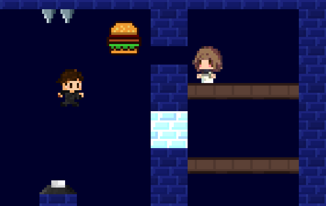

# 👑 The Princess's Belly

Un juego de puzzle y plataformas donde debes satisfacer el hambre voraz de la Princesa Lu 🍕

## 📖 Descripción

Encarna a un joven samaritano que debe recolectar comida y superar diversos desafíos para satisfacer a la Princesa. Navega por mazmorras, evita trampas y llega a la meta en cada nivel.

## 🎮 Características

- **Mecánicas variadas**: recolección de objetos, plataformas, trampas
- **Sistema de vidas** con contador de muertes
- **Efectos de sonido** y música inmersiva
- **Interfaz completa** con menú, pausa y pantalla final

## 🎮 Cómo Jugar

- Mueve el personaje, salta y recolecta comida
- Evita las trampas
- Llega a la princesa para completar el nivel
- ¡Supera todos los niveles para ganar!

## 🌐 Jugar Online

¡Puedes jugar online en: [The Princess's Belly en itch.io](https://fmiceli.itch.io/the-princesss-belly)

## 🛠️ Desarrollo

**Creador:** [Francisco Miceli](https://github.com/fmicelii)

**Profesor:** [Santiago Beitia](https://github.com/santiagoblas)

**Engine:** Godot 4.6

**Tipo:** Proyecto escolar
